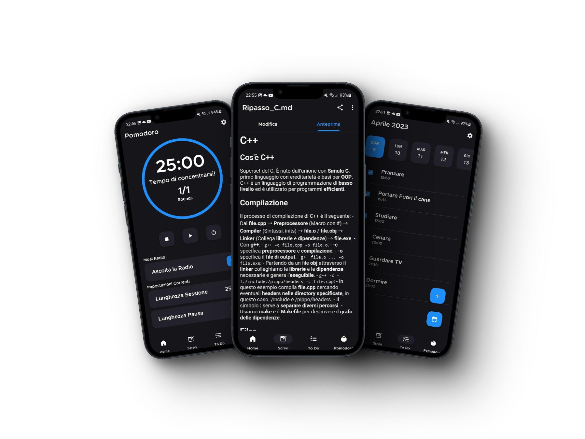

# Moai Planner: Applicazione mobile per la produttività.

  

  

## Features:

- Pianificazione del lavoro e impegni (es. ToDoList, Pomodoro Timer).
- Funzionalità per aiutare a concentrarsi (es. Metodo pomodoro, Musica).
- Scrittura di note e appunti in formato markdown. 
- Possibilità di organizzare le note attraverso un File Manager su Cloud (Aggiunta, Cancellazione di note e cartelle).
- Sistema di account per mantenere tutto sincronizzato su diversi dispositivi e accesso con Google.

## Documentazione e Presentazione
- [Docs](Moai%20Planner%20-%20Documentazione%20-%20Gruppo%20Airdroppers.pdf)
- [Presentazione](Moai%20Planner%20-%20Presentazione%20-%20Gruppo%20Airdroppers.pdf)
- [Screenshots](screeshots)

## Gruppo e Autori:
__Nome Gruppo:__ 
- Airdroppers

__Autori:__
- Gargiulo Elio 869184 (Referente)
- Rigato Stefano 869441
- Mocellin Andrea 869218
- Lamanna Francesco 869052
- Isavo Benavides Milla Nicolle 875386  

## Link utili
- [Firebase](https://firebase.google.com/docs/reference/kotlin/packages?authuser=1)
- [Firebase Authentication](https://firebase.google.com/docs/auth/android/start?authuser=1#kotlin+ktx_2)
- [Material3](https://m3.material.io/)
- [Documentazione Kotlin](https://kotlinlang.org/docs/home.html)
- [Documentazione Android](https://developer.android.com/docs?hl=it)
